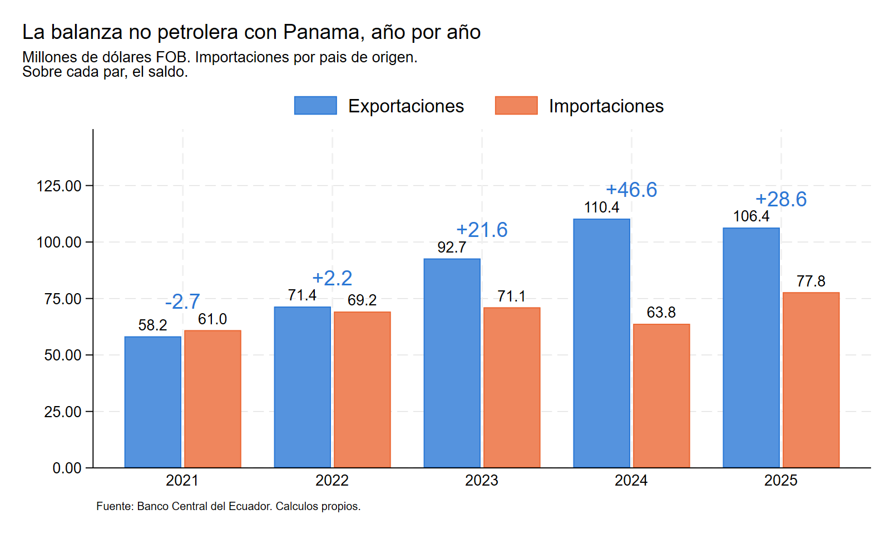

# Panamá en el comercio exterior ecuatoriano

**Qué mide el registro bilateral y sobre qué puede operar un Acuerdo de Alcance
Parcial.** Informe técnico, base de datos y programación completa del comercio no
petrolero entre Ecuador y Panamá, 2021–2025.

Mario Saeteros Pérez, septiembre de 2026.

### 📄 [Descargar el informe (PDF, 15 páginas)](informe/informe_panama_ecuador_saeteros_sept2026.pdf)

También está en la [página de descargas](https://mariosaeteros90.github.io/aap-ecuador-panama/).

---

El trabajo se hizo a propósito de la firma de los Términos de Referencia del
Acuerdo de Alcance Parcial entre los dos países, el 4 de septiembre de 2026. Todo
lo que aparece en el informe se calcula con los do-files de este repositorio y con
la base que está en `datos/`. No hay cifras traídas de otro lado.

El punto de partida es una distinción que la discusión pública suele pasar por
alto. Panamá aparece como un socio grande porque concentra el tránsito de
hidrocarburos y porque buena parte de lo que llega desde allá no se produce allá.
En 2025 Ecuador registró 77,8 millones de dólares de importaciones de origen
panameño y 612,9 millones de procedencia panameña. Separando el petróleo y
separando los dos universos, lo que queda es una relación comercial mucho más
pequeña, pero superavitaria, diversificada y creciente.

## Qué contiene

    datos/          Base_Final.xlsx, la base única de la que sale todo
    do/             la programación en Stata (master.do y siete módulos)
    informe/        el informe técnico en PDF
    resultados/     las salidas ya generadas: cinco Excel y los gráficos

Las carpetas `inn/`, `aux/` y `log/` no están versionadas porque el propio
programa las crea y las llena la primera vez que se corre.

## Cómo reproducir los resultados

Se necesita Stata 17 o superior. La programación se corrió en Stata 19 para
Windows.

1. Descargar o clonar el repositorio.
2. Abrir `do/master.do` y editar la línea del `global path` con la ruta de la
   carpeta descargada. Es la única línea que hay que tocar.
3. Correr `master.do` completo.

El programa crea `inn/`, `aux/` y `log/`, reconstruye las bases de trabajo desde
el Excel y regenera las cinco salidas y los once gráficos. Toma unos minutos.

`00_prepara_bases.do` es el único módulo que lee el Excel. Los módulos 01 a 06
leen de `aux/` y se pueden correr sueltos una vez que 00 terminó.

## La programación

| Archivo | Qué hace |
|---|---|
| `master.do` | Rutas, parámetros y orden de ejecución |
| `_rutinas.do` | Siete programas reutilizables: concentración, márgenes, supervivencia, participación constante de mercado, similitud, Grubel-Lloyd, complementariedad |
| `00_prepara_bases.do` | Lectura del Excel, clasificación sectorial, cinco controles de integridad |
| `01_conciliacion.do` | Reproducción de las cifras públicas y espejo con el registro panameño |
| `02_canales.do` | los canales de la relación y la participación de reexportación |
| `03_composicion.do` | Composición sectorial, rankings de subpartidas, concentración, similitud |
| `04_indicadores.do` | Grubel-Lloyd con sensibilidad, complementariedad, Finger-Kreinin |
| `05_dinamica.do` | Márgenes intensivo y extensivo, CMS, supervivencia con contrafactual |
| `06_graficos.do` | Gráficos de diagnóstico (prefijo g) y de publicación (prefijo p) |

Los cinco controles de `00_prepara_bases.do` no son decorativos. Tres de ellos se
escribieron después de encontrar errores reales en la descarga: una serie CIF
rotulada como FOB que duplicaba el flujo, un bloque descargado en miles de
dólares y un cambio de formato del Excel que convertía el código arancelario en
numérico y reclasificaba en silencio los capítulos 01 a 09. Si alguno de los
controles falla, el programa se detiene.

## Advertencia sobre los dos universos de importación

El análisis mantiene separadas las importaciones por país de origen y por país de
procedencia, y no las mezcla en ningún cuadro. La distinción no es un tecnicismo:
en 2025 Ecuador registró 77,8 millones de dólares de importaciones de origen
panameño y 612,9 millones de procedencia panameña. Una preferencia arancelaria
opera sobre el primer universo. El segundo describe la función logística de
Panamá.

Las exportaciones se registran siempre por país de destino declarado y no admiten
esa distinción. Por eso no se construye ninguna balanza que reste un flujo medido
por destino contra otro medido por procedencia.

## Fuentes

Las cifras ecuatorianas son del Banco Central del Ecuador. Se usaron tres
descargas independientes: exportaciones FOB por país de destino declarado,
importaciones por país de origen e importaciones por país de procedencia, estas
dos últimas en valor CIF y FOB, a diez dígitos del arancel nacional, 2021–2025.

Las cifras panameñas son del Instituto Nacional de Estadística y Censo de Panamá,
a doce dígitos, 2021–2024, y cubren los cinco flujos que ese registro distingue.
Se emplean solo como verificación externa del orden de magnitud y como fuente de
la sección 6 del informe.

## Licencia

El código de `do/` está bajo licencia MIT. El informe, la base de datos y las
salidas están bajo Creative Commons Atribución 4.0 Internacional (CC BY 4.0). En
ambos casos se puede reutilizar citando la fuente.

## Cómo citar

Saeteros Pérez, M. (2026). *Panamá en el comercio exterior ecuatoriano: qué mide
el registro bilateral y sobre qué puede operar un Acuerdo de Alcance Parcial*.
Repositorio de datos y programación.
https://github.com/mariosaeteros90/aap-ecuador-panama
